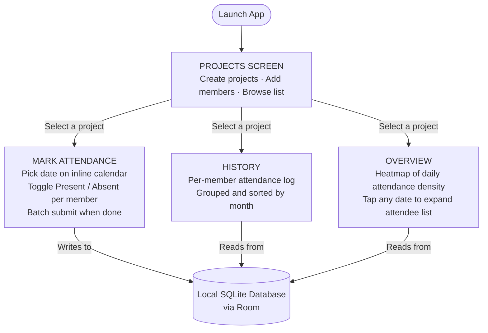
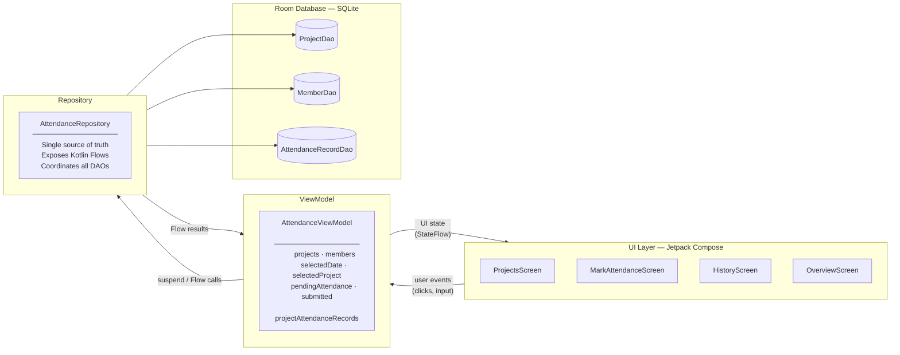
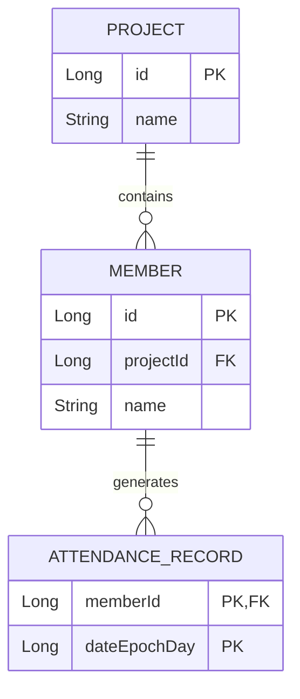

# Attendance Tracker — Android

A modern Android attendance management app built with Jetpack Compose, Material 3, and Room. Track attendance across multiple projects with an interactive calendar, heatmap overview, and per-member history — all stored locally with no server required.

> Built entirely with AI Agent assistance (Claude Code / Anthropic).

---

## Features

| Feature | Description |
|---------|-------------|
| Multi-Project Dashboard | Create and manage separate attendance lists per project or group |
| Inline Calendar | Tap-to-select date picker displayed inline — no manual date entry |
| Batch Attendance Grid | Avatar grid with Present / Absent toggle; submit all at once |
| Member History | Per-member attendance log grouped and sorted by month |
| Overview Heatmap | Visual daily attendance density with expandable attendee lists per date |
| Light / Dark Mode | Material 3 dynamic theming with indigo primary palette |

---

## How It Works

### User Journey

How a user moves through the app from first launch to daily use:



---

### Architecture — MVVM Data Flow

How the UI, business logic, and data layers connect. This is the entry point for any UI/UX change — edit a Screen composable for visual changes, edit the ViewModel for state logic, edit the Repository or DAO for data behaviour:



---

### Data Model

The three entities stored in the local database and how they relate to each other:



> **For future UI/UX additions:** Any new screen only needs to (1) query the existing three tables via a new DAO method, (2) expose the result as a `StateFlow` on the ViewModel, and (3) build the Compose screen. No schema changes are required for most analytics or visualisation features.

---

## Architecture

MVVM + Repository pattern:

```
UI Layer        — Jetpack Compose screens and reusable components
ViewModel       — AttendanceViewModel (UI state + business logic)
Repository      — AttendanceRepository (single source of truth)
Data Layer      — Room database (entities: Project, Member, AttendanceRecord)
```

**Package layout:**

```
com.example.attendancetracker/
├── data/
│   ├── AttendanceDatabase.kt
│   ├── AttendanceRecord.kt / AttendanceRecordDao.kt
│   ├── Member.kt / MemberDao.kt
│   ├── Project.kt / ProjectDao.kt
│   └── AttendanceRepository.kt
├── ui/
│   ├── screens/
│   │   ├── ProjectsScreen.kt
│   │   ├── MarkAttendanceScreen.kt
│   │   ├── HistoryScreen.kt
│   │   └── OverviewScreen.kt
│   ├── components/
│   │   ├── InlineCalendar.kt
│   │   ├── MemberAvatarCard.kt
│   │   └── AgentMarker.kt
│   └── theme/Theme.kt
├── AttendanceViewModel.kt
└── MainActivity.kt
```

---

## Tech Stack

| Component | Details |
|-----------|---------|
| Language | Kotlin 2.4.0 |
| UI | Jetpack Compose (BOM 2026.05.00), Material 3 |
| Navigation | Navigation Compose 2.7.7 |
| Database | Room 2.8.4 via KSP 2.3.9 |
| Async | Kotlin Coroutines + Flow |
| Build toolchain | AGP 9.2.0, Gradle 9.4.1 |
| Min SDK | API 26 (Android 8.0 Oreo) |
| Target SDK | API 37 |

---

## Prerequisites

- **JDK 17 or later** — the project targets JVM 17 bytecode; any JDK ≥ 17 works as the build host (JDK 21 and 26 both tested).
- **Android SDK** — API 37 platform and Build-Tools 36 are installed automatically on first build if Android SDK Manager is configured.
- **Android device or emulator** — running Android 8.0 (API 26) or higher.

### Setting JAVA_HOME (macOS)

The `./gradlew` script needs `JAVA_HOME` to point to a valid JDK. If `java -version` errors, set it manually before building:

```bash
# Homebrew OpenJDK (any version ≥17):
export JAVA_HOME=/opt/homebrew/opt/openjdk/libexec/openjdk.jdk/Contents/Home

# Or use java_home helper if JDK 17 is registered:
export JAVA_HOME=$(/usr/libexec/java_home -v 17)

# Add to ~/.zshrc to make it permanent
```

---

## Building Locally

### Option A — Command line

```bash
# 1. Clone the repository
git clone <repo-url>
cd attendance-tracker-android

# 2. (macOS only, if needed) Set JAVA_HOME — see section above

# 3. Build the debug APK
./gradlew assembleDebug
```

The APK is written to:
```
app/build/outputs/apk/debug/app-debug.apk
```

> Add `--no-daemon` when building in CI or single-run environments to avoid a lingering Gradle daemon process.

### Option C — Automated Build & Export (Recommended)

The project includes an automated script `./build_and_export_apk.sh` that:
1. Resizes the **Neon Dark Calendar** custom launcher icon to all standard Android mipmap sizes.
2. Compiles and builds the debug APK.
3. Automatically exports the built APK directly to your Desktop.

To execute it, run:
```bash
./build_and_export_apk.sh
```

The exported APK will be located at:
`/Users/kunal/Desktop/apk/attendance-tracker.apk`

### Option B — Android Studio

1. Open Android Studio **Meerkat (2024.3)** or later.
2. **File → Open** → select the project root folder.
3. Wait for Gradle sync to complete.
4. Select a device or emulator from the toolbar, then click **Run ▶**.

---

## Running Tests

### Option A — Unified Test Script (Local Verification)
The project includes a unified test runner script `./run_all_tests.sh` that automates starting the emulator, waiting for the boot sequence, running both unit and instrumented tests, and collecting outputs.

To execute it, run:
```bash
./run_all_tests.sh
```

### Option B — Run Manually

#### 1. Unit Tests
To run the 14 JVM-based unit tests for the ViewModel:
```bash
./gradlew test
```
The HTML test report is written to:
`app/build/reports/tests/testDebugUnitTest/index.html`

#### 2. Instrumented Smoke Tests
To run the 7 Compose instrumented UI tests on a connected device/emulator:
```bash
./gradlew connectedDebugAndroidTest
```
The HTML test report is written to:
`app/build/reports/androidTests/connected/index.html`

---

## Installing the APK on a Device

### Method 1 — ADB (recommended for developers)

1. Enable **Developer Options** on your Android device:
   - Settings → About Phone → tap **Build Number** 7 times.
2. Enable **USB Debugging**:
   - Settings → Developer Options → USB Debugging → ON.
3. Connect the device via USB, then run:
   ```bash
   adb install /Users/kunal/Desktop/apk/attendance-tracker.apk
   ```

### Method 2 — Manual sideload

1. Transfer `attendance-tracker.apk` to the device (USB, Google Drive, email, etc.).
2. Open a file manager on the device and tap the APK to install.
3. If blocked by "Install unknown apps" restriction:
   - Tap **Settings** on the prompt → enable **Allow from this source** → go back → tap **Install**.

---

## License

[MIT License](LICENSE) © 2026 Kunal Debnath
